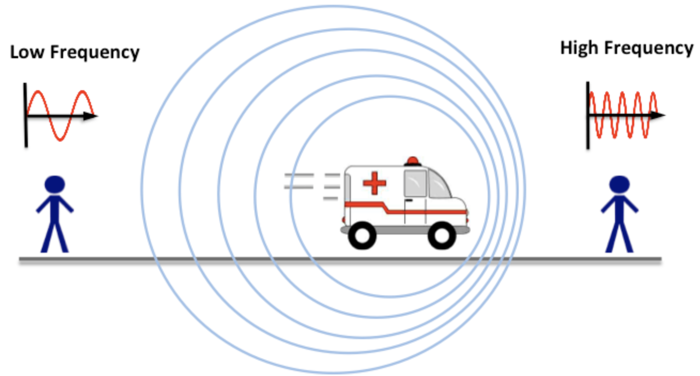

## Starter

Bodgan is observing a star through a telescope, and it appears to be orange. He looks up the wavelength of orange light and finds it to be around $600nm$.

1. What is the frequency of orange light, given than the speed of light is $c=3 \times 10^{8}$?
2. Using your value for frequency, what is the period of the orange light?
3. Draw a rough wave for this orange light, labelling the wavelength and an arrow indicating the velocity.

---

## The Doppler Effect

- When the frequency of a wave is altered due to __relative motion__ between the object and the observer
- Think: the siren on an ambulance as it drives past!

---

<iframe width="100%" height="315" src="https://www.youtube.com/embed/Djz_rtnXSfY" frameborder="0" allow="accelerometer; autoplay; encrypted-media; gyroscope; picture-in-picture" allowfullscreen></iframe>

---

### Task: Copy this into your books

---

### What is Observed

- __Sound:__ As a car approaches, the wavefront is compressed and the frequency is increased (pitch increases). As it passes, the wavefront is expanded, the frequency thus decreases (pitch decreases).
- __Light:__ Doppler for light is also known as redshift: a star moving towards us has an increased frequency (bluer light), and a star moving away from us has a decreased frequency (redder light)

---

<iframe width="100%" height="315" src="https://www.youtube.com/embed/ikgRZt1BSyk" frameborder="0" allow="accelerometer; autoplay; encrypted-media; gyroscope; picture-in-picture" allowfullscreen></iframe>

---

### The Equations

- To work with the __doppler effect__ we will need to be confident using the equations we learned last week!
- If you do not have these equations in your book, copy them down and include the units for each variable.

\\[
\begin{align*}
    & v = f\lambda \\\\
    & velocity = frequency \times wavelength \\\\
\end{align*}
\\]

---

\\[
\begin{align*}
    & f = \frac{1}{T} \\\\
    & frequency = \frac{1}{period}
\end{align*}
\\]

---

#### Question 1

Police can use radar guns to measure the amount of compression or expansion of the frequency due to the relative motion of the offending car.

1. The gun emits waves with $f=100MHz$. What wavelength is this?
2. The gun reads $f=75MHz$ when the car is approaching. What wavelength is this?
3. The gun reads $f=125MHz$ when the car is receeding. What wavelength is this?

---

#### Doppler Equation

Some new notation!

- $v_{w}$: the velocity of the wave in the medium
- $v_{w}$: the velocity of the source
- $f$: the __actual__ frequency of the wave produced by the source ($Hz$)
- $f'$: the __observed__ frequency of the wave ($Hz$)

---

\\[
\begin{align*}
    & f' = f\frac{v_{w}}{v_{w} \pm v_{s}}
\end{align*}
\\]

---

What is the $\pm$ symbol?

- $v_{w} \pm v_{s}$ means, in words, __the velocity of the wave relative to the source__
- If the source is moving in the same direction as the wave (approaching), the wave appears to be moving away slower relative to the source, so we must __subtract__
- If the source is moving away from the wave (receeding), the wave appears to be moving away faster relative to the source, so we must __add__ 

---

#### Question 2

A doctor at the hospital hears an ambulance leave the hospital at $30km/h$ and return 15 minutes later at a speed of $35km/h$. Both times its siren is sounding at a frequency of $4000Hz$.

1. Calculate the observed frequency as the ambulance leaves.
2. Calculate the observed frequency as the ambulance returns.

---

<iframe width="100%" height="315" src="https://www.youtube.com/embed/JO4_VHM69oI" frameborder="0" allow="accelerometer; autoplay; encrypted-media; gyroscope; picture-in-picture" allowfullscreen></iframe>

---

## Homework: Question 9 of the Homework Booklet

Due Monday

---