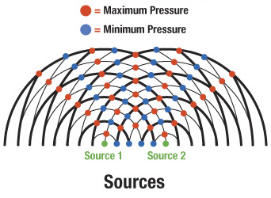
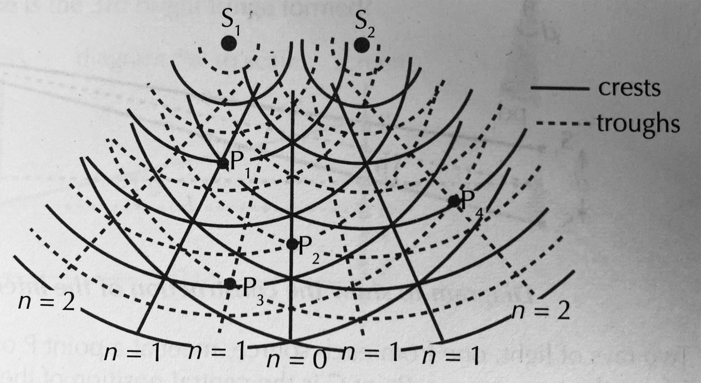
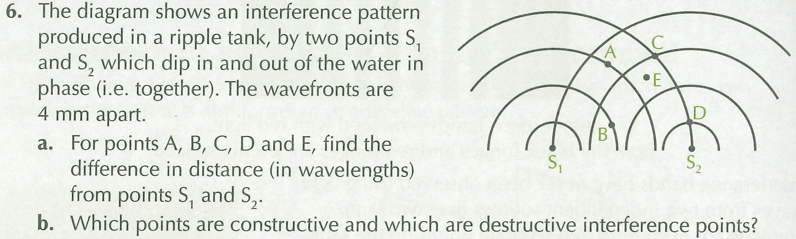
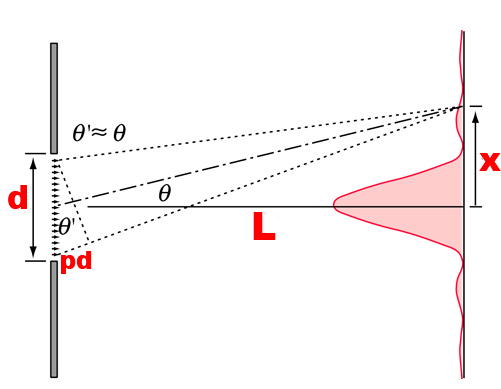

<iframe width="812" height="457" src="https://www.youtube.com/embed/Iuv6hY6zsd0" frameborder="0" allow="accelerometer; autoplay; encrypted-media; gyroscope; picture-in-picture" allowfullscreen></iframe>

---

## Learning Outcomes

- Explain the interference of two wave patterns in terms of nodes, anti-nodes and path difference

---

## Diffraction {.c2}

- When waves pass through an opening or bump against a barrier, they will __diffract__
- __Openings__: The most diffraction occurs when the opening width and wavelength are similar

---

## Diffraction {.c2}

- __Barriers__: Longer wavelengths diffract best around barriers e.g. AM radio has a longer wavelength than FM and can be better heard in the mountains
- Notice that the wavelength does not change when diffraction occurs.

---

## Constructive vs Destructive Interference {.c2}

- Recall the following:
    - __In phase__ waves constructively interfere
    - __Out of phase (180deg)__ waves destructively interfere

---

## Two Point Source Interference {.c2}

- Two point sources with the same frequency and amplitude are placed near each other
- Their waves will interfere to create points of zero amplitude, and points of 2x amplitude of the original wave

---

---

## Interference of Light {.c2}

- For light to interfere we need:
    - Waves of the same frequency
    - Waves with the same amplitude
    - Waves with a stable phase relationship (__coherent__)

---

## Interference of Light {.c2}

- To interfere light, we usually take a source that produces a single wavelength and pass it through two small slits

---

## Path Difference

---

## Path Difference

- Moving away from the centre point, the distance each wave travels changes
- This changing difference means that the waves will not keep a constant phase relationship
- We call the difference in the distance they travel the __path difference__

---

<aside class="notes">
1. Label the nodal and antinodal lines
2. Determine which of P1, P2, P3 and P4 are nodes and antinodes
3. Count the number of wavelengths that P1, P2, P3, and P4 are from each source
4. Try and determine a general rule for the path difference of notes and antinodes
</aside>

---

## Path Difference {.c2}

- Path difference can be written as $pd$
- __Antinodal Lines__: $pd = n\lambda$
- __Nodal Lines__: $pd = (n - \frac{1}{2})\lambda$

---

## Calculations

<aside class="notes">
1. Draw P5 and P6 on a node an antinode.
2. Ask the students to determine whether they are nodes or antinodes
3. Ask them to calculate, using the equations, the path difference.
</aside>

---

## Starter

- If you used the equations, verify by counting wavelengths on the diagram.
- If you used the diagram, verify your answer by doing calculations.

---

## Interference Formula

<aside class="notes">
1. For the triangle with $\theta$, $tan(\theta)=\frac{y}{D}$
2. For the triangle with $\theta'$, $sin(\theta')=\frac{\delta}{d}$
3. We can say $tan(\theta) \approx sin(\theta) \approx \theta \approx \frac{y}{D}$
</aside>

---

## Interference Formula {.c2}

\begin{align*}
    \theta &= \frac{x}{L} \\
    L \theta &= x \\
    L \frac{pd}{d} &= x \\
    L pd &= dx \\
    pd &= \frac{dx}{L}
\end{align*}

<aside class="notes">
$pd = n\lambda$ OR $pd = (n - \frac{1}{2})\lambda$
</aside>

---

## Interference Formula {.c2}

\begin{align*}
    pd &= \frac{dx}{L}
\end{align*}

- $pd$ is path difference (m)
- $d$ is source separation (m)
- $x$ is fringe separation (m)
- $L$ is distance from source to screen (m)

---

## Interference Formula {.c2}

\begin{align*}
    x = \frac{pdL}{d}
\end{align*}

- as wavelength increases, so does the spacing (x)
- as L increases, so does the spacing (x)
- as separation increases, the spacing decreases

---

## Interference Formula {.c2}

- Since $d sin(\theta) = pd$
- $pd = n\lambda$ AND $pd = (n - \frac{1}{2})\lambda$
- $d sin(\theta) = n\lambda$ for antinodes
- $d sin(\theta) = (n-\frac{1}{2})\lambda$ for nodes
