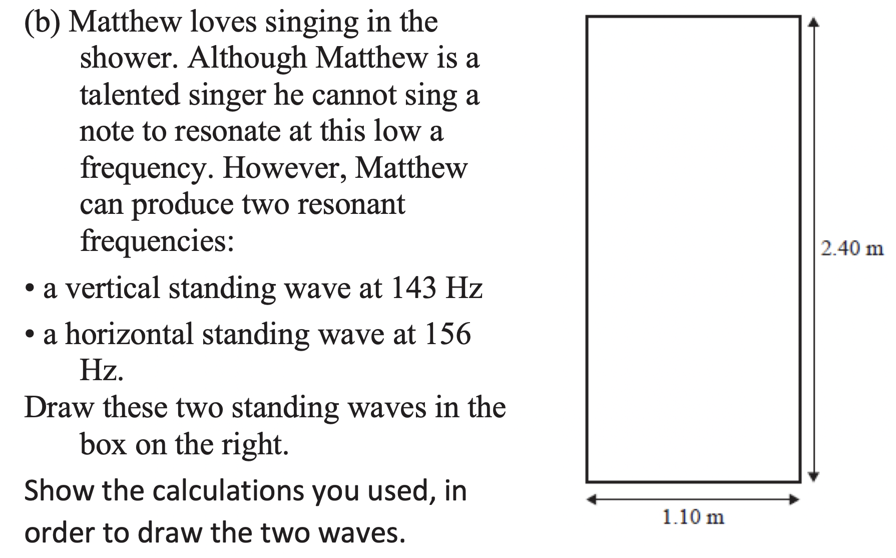

## Learning Outcomes

Explain the basic structure and wavelength of a standing wave

---

## Standing Waves

Most musical instruments produce sound through vibration of __standing waves__ in strings or columns of air

<iframe width="1920" height="800" src="https://www.youtube.com/embed/RNt8d6vJj8c" frameborder="0" allow="accelerometer; autoplay; encrypted-media; gyroscope; picture-in-picture" allowfullscreen></iframe>

---

## Waves in a String

1. The particles oscillate perpendicular to the direction of the wave,
2. the wave _appears_ to move along the string,
3. the wave is reflected and can travel back and forth

---

- When two identical waves travelling in opposite directions interfere, they can form a standing (stationary) wave.
- No energy is transferred in a standing wave, because the particles are oscillating around a point of equilibrium.
- Peaks and troughs are points of maximum potential energy, and the line of equilibrium is a point of maximum kinetic energy.

---

## Nodes & Antinodes

- __Node__: A point of __no__ displacement from equilibrium
- __Antinode__: A point of maximum displacement from equilibrium

---

## Producing Standing Waves

- Because both ends of the string have to be nodes, only certain frequencies will be able to produce standing waves.

---

<iframe width="1920" height="800" src="https://www.youtube.com/embed/O1-CRFcX980" frameborder="0" allow="accelerometer; autoplay; encrypted-media; gyroscope; picture-in-picture" allowfullscreen></iframe>

---

<iframe width="1920" height="800" src="https://www.youtube.com/embed/LT7MOirwZdM" frameborder="0" allow="accelerometer; autoplay; encrypted-media; gyroscope; picture-in-picture" allowfullscreen></iframe>

---

<iframe width="1920" height="800" src="https://www.youtube.com/embed/2awbKQ2DLRE" frameborder="0" allow="accelerometer; autoplay; encrypted-media; gyroscope; picture-in-picture" allowfullscreen></iframe>

---

## Standing Waves {.c2}

- The length of the string is defined as $L$
- The frequency with the longest wavelength that fits into the string/pipe is called the __fundamental__ or __1st harmonic__
- On a string, the fundamental has $\lambda = 2L$

---

### Harmonics {.c2}

- We can calculate the harmonic wavelength & frequency using these relationships:

\begin{align*}
    \lambda &= \frac{\lambda_{fundamental}}{\text{harmonic number}} \newline
    f &= f_{fundamental} \times \text{harmonic number}
\end{align*}

---

## Question 1

Calculate the fundamental frequency of a string with length 25cm, where the speed of sound is $330ms^{-1}$.

---

\begin{align*}
    \lambda &= \frac{1}{2} \times 0.25m = 0.125m\newline
    f &= v \times \lambda \newline
    f &= 330 \times 0.125 = 41.25Hz
\end{align*}

---

## Question 2

Calculate the 3rd harmonic for a string with length 25cm where the speed of sound is $330ms^{-1}$.

---

## Mahi Tuatahi

---

## Learning Outcomes

5. Explain the modes of resonance of a string in terms of the fundamental vibration and the harmonics
6. Calculate the harmonic frequencies of a string

---

## Resonance in Strings {.c2}

1. Calculate the wavelength of the harmonic using the wavelength relationship $\lambda_{n} = \frac{2L}{n}$
2. Use the wave formula $v=f\lambda$ to calculate the frequency of the harmonic

---

---

---

## Open Ended Pipes {.c2}

- Open ends of a pipe are __antinodes__ - places of maximum displacement
- A single open end fundamental has  $\lambda = 4L$
- A single open end can only produce harmonics when $n$ is odd
- Double open ends has fundamental $\lambda = 2L$

---

---

## Mahi Tuatahi

Quizziz: https://quizizz.com/admin/quiz/5a7d8747b69214001faec0e9/standing-waves

---

## Harmonics vs Overtones

|     |              | String       | Closed Pipe  | Open Pipe    |
|:----|:-------------|:-------------|:-------------|:-------------|
| n=1 | 1st Harmonic | Fundamental  | Fundamental  | Fundamental  |
| n=2 | 2nd Harmonic | 1st Overtone |              | 2nd Overtone |
| n=3 | 3rd Harmonic | 2nd Overtone | 1st Overtone | 3rd Overtone |
| n=4 | 4th Harmonic | 3rd Overtone |              | 4th Overtone |
| n=5 | 5th Harmonic | 4th          | 2nd Overtone | 5th Overtone |

---

## Musical Wind Instruments

- In order to produce different frequencies in a wind instrument, wind is generally sent past a sharp lip.
- This sharp lip will create a large number of frequencies, but only specific ones will produce standing waves and therefore resonant frequencies.

---

---

## Timbre {.c2}

- Different instruments playing the same frequency will produce a different set of harmonics, causing the quality of the note to be quite different.

---

## Homework Booklet Q13
