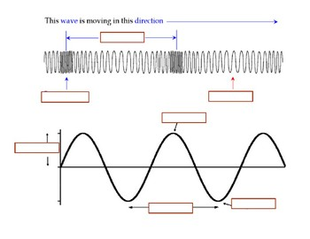
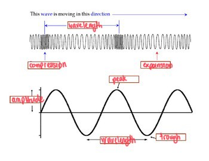

## About the Unit

- Wave Systems
- AS91523
- 4 Credits, Level 3 (External)
- Not in the school exams!
- End of topic test in Term 3 Week 9

---

To start this unit off we are going to spend a week doing some learning about the fundamentals of waves from the Year 12 paper, before moving on to Year 13 specific stuff.

---

## What is a wave?

Energy can be transferred from one place to another through either kinetic or electromagnetic waves.

---

### Mechanical Waves

Waves that are vibrations pass through a solid or other medium. Think, the ocean or a slinky.

__NB:__ They __require__ a medium in which to travel.

---

### Electromagnetic Waves

Waves that are part of the electromagnetic spectrum (light, radio waves, infrared, etc).

__NB:__ They __do not require__ a medium in which to travel. Can travel through the vaccuum.

---

The waves that we will be looking at this year have repetition in their motion, and are called __periodic waves__. This periodicity allows us to predict their interactions with relative ease.

---

## Transverse vs Longitudinal Waves

- __Longitudinal:__ The vibration (displacement) is parallel to the direction of motion of the wave (e.g. sound). Think of compression and expansion.
- __Transverse:__ The vibration (displacement) is perpendicular to the direction of motion of the wave (e.g. electromagnetic waves like light).

---

---

---

## Labelling a Wave

__Task:__ Sketch this unlabelled wave into your book on the axis.

---

- __Peak:__ The highest point on a wave
- __Trough:__ The lowest point on a wave
- __Amplitude (A):__ The point of greatest displacement from rest on the wave (midpoint to peak, midpoint to trough) (in $m$)
- __Wavelength $\lambda$:__ The distance (in $m$) between consecutive points of idential displacement on the wave (peak to peak, trough to trough, midpoint to midpoint etc.)

---

- __Compression:__ The point where the wavelength is most squished together
- __Expansion:__ The point where the wavelength is most spread out
- __Velocity $v$:__ The velocity (in $ms^{-1}$) of the wave shape

---

---

---

### Period vs. Frequency

- __Period $T$:__ The time taken, in $s$, for one wave to pass any point. For example, a period of 5s means it takes 5 seconds for consecutive peaks to pass a given point.
- __Frequency $f$:__ The number of waves that pass a point in a second, measured in "per second" $s^{-1}$, better known as Hertz $Hz$.

---

The period is very closely linked to the frequency as you can see from their definitions. There is a very simple formula for converting between them:

\begin{align*
    & T = \frac{1}{f} \\\\
    & f = \frac{1}{T}
\end{align*

---

We can also relate the __velocity__, __frequency__, and __wavelength__ with the __wave equation__:

$$
v = f\lambda
$$

