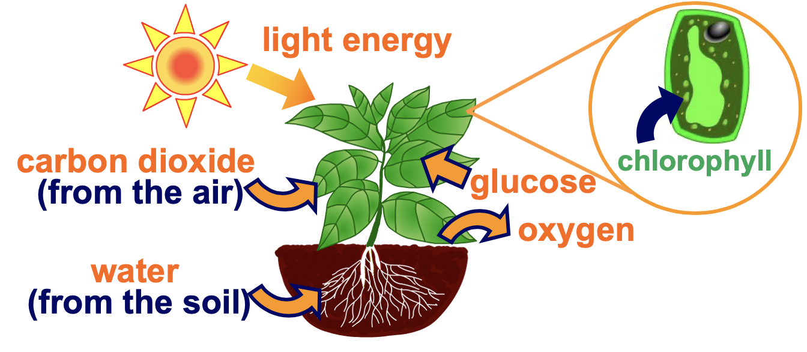
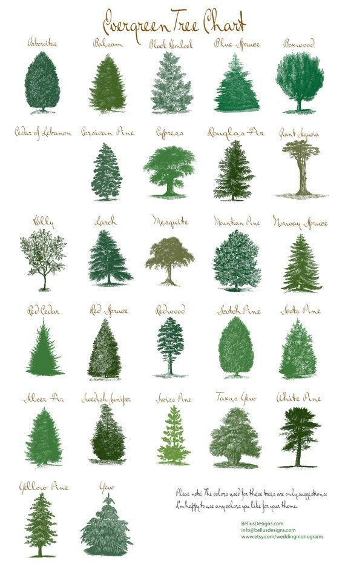
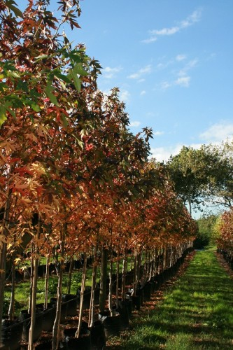
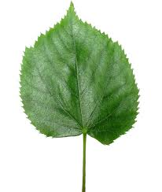
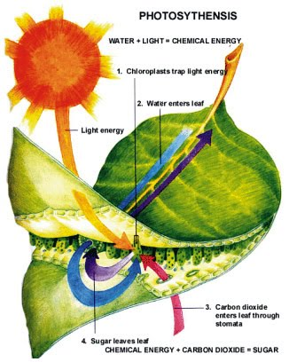

## Starter

Respiration and photosynthesis can be thought of as opposites to each other.

1. Give the equation for __respiration__
2. Give the equation for __photosynthesis__
3. Discuss with the person next to you why plants and animals are important for each others survival using the equations above.

---

<iframe width="456" height="254" src="https://www.youtube.com/embed/pMJ1KqZKF-k" frameborder="0" allow="accelerometer; autoplay; encrypted-media; gyroscope; picture-in-picture" allowfullscreen></iframe>

---

- Leaves are little factories that create energy for the plant!
- They combine carbon dioxide and water inside chloroplasts

## Evergreen Trees {.col-2}

- Evergreen trees has leaves throughout the year, and they are always green.
- Some examples are pine, eucalyptus and rainforest trees.
- Some evergreen tree leaves can live up to 30 years!

## Deciduous Trees {.col-2}

- Shed their leaves as an adaptation to a cold or dry/wet season.
- This helps them survive when there are less nutrients, sunlight, water etc. available
- When cold, organic material (dead plants & animals) decays slowly (fewer nutrients)

## Adaptations of Leaves {.col-2}

- Broad and flat to capture lots of sunlights
- Veins carry water to the leaf and carry sugar to the rest of the plant
- Some cells contain chloroplasts with chlorophyll
- Have stomata on the underside to allow gasses in and out

## What is Glucose Used For? {.col-2}

- Used in respiration straight away to produce energy
- Converted into starch for long-term energy storage
- Used to make new chemicals like proteins, fats and other sugars

