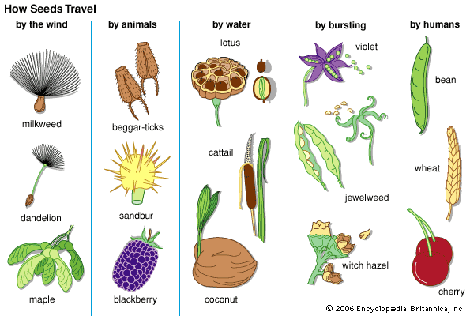
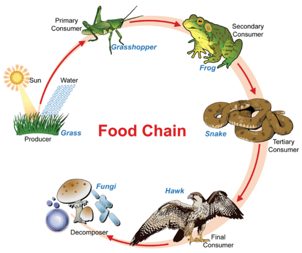
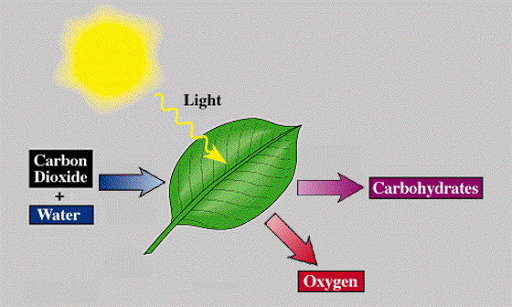
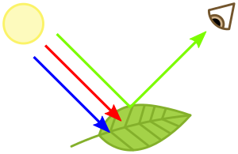
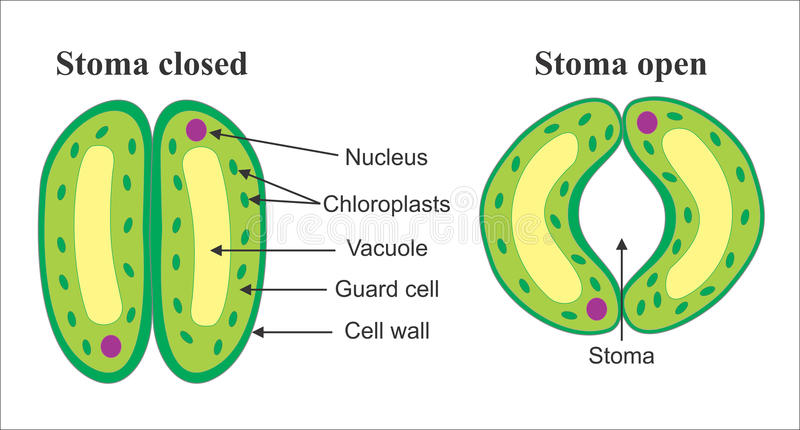

## Starter

Choose two seeds below. In your book, __Describe at least two adaptations that help it be dispersed and explain why dispersal is important.__

---

## Learning Outcomes

1. Describe and explain the process of photosynthesis
2. Explain why plants are so important to life on Earth

---

<iframe width="1280" height="720" src="https://www.youtube.com/embed/uixA8ZXx0KU" frameborder="0" allow="accelerometer; autoplay; encrypted-media; gyroscope; picture-in-picture" allowfullscreen></iframe>

---

## The Importance of Photosynthesis

- The sun is the main source of energy for life on Earth
- Plants are the first step in the energy chain. They convert light into chemical energy (sugar)!
- Next, herbivores consume the plants, and carnivores or omnivores consume the herbivores!

---

---

What else do plants do?

- They take in carbon dioxide gas (our waste product)
- They produce __oxygen gas__ for us to breathe!

---

### The Equation

\begin{align*}
    \text{carbon dioxide} + \text{water} \xrightarrow{\text{light}} \text{sugar} + \text{oxygen} + \text{energy}
\end{align*}

---

## Where Does Photosynthesis Occur?

- Plant cells have 10-100 chloroplasts
- Photosynthesis occurs in chloroplasts
- Chloroplasts have a pigment called chlorophyll which makes them green!

---

### How do Plants Breathe?

- They have small openings in their leaves called stomata
- These stomata allow carbon dioxide in, and oxygen gas out

---

### Task: Draw this Into Your Book

